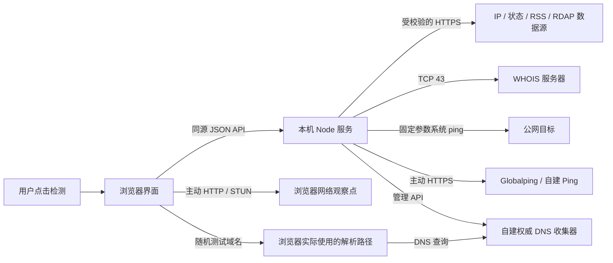
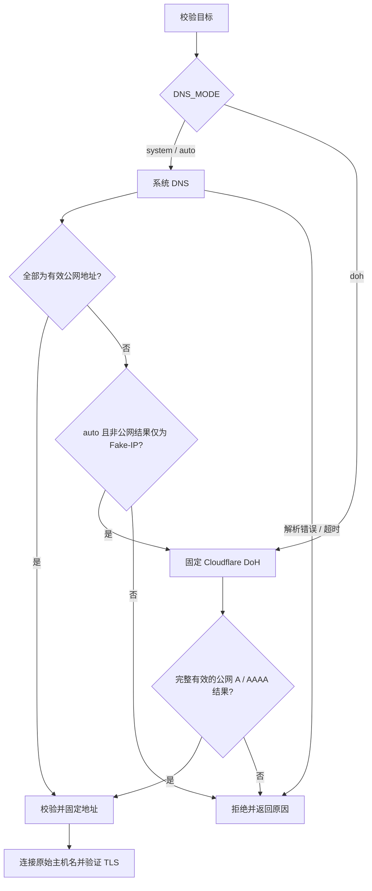

# 架构与数据路径 / Architecture

AI 体检站由浏览器界面和同机 Node.js 服务组成。前端使用 React / TypeScript，Vite 构建到 `dist/`；正式运行的后端仅使用 Node 内置模块。DNS 收集器与远程 Ping 节点是独立的可选服务。

This document describes implementation boundaries. It is not evidence that every network path or platform has been tested; see [VALIDATION.md](VALIDATION.md).

## 组件

| 位置 | 职责 |
| --- | --- |
| `src/Workbench.tsx` | 页面、用户触发、来源选择、模块结果与加载状态；Claude / ChatGPT 分开存储结果 |
| `src/client.ts` | 同源 API 客户端、浏览器出口 / HTTP 计时、来源平台归属、可选本地历史 |
| `src/browser-tools.ts` | 本地设备检查、WebRTC 生命周期与脱敏 |
| `src/card-tools.ts` | 原创主题 / 几何纹样 / 印章，以及本地 SVG 卡片生成 |
| `lib/diagnostics.ts` | 诊断解释、地区资料与官方链接 |
| `server/index.mjs` | 本地 HTTP 服务、静态资源、API 路由、来源 / 会话检查、请求限制 |
| `server/config.mjs` | 默认来源、JSON 校验、平台标记与 DNS 模式 |
| `server/security.mjs` | 公网目标校验、系统 DNS / DoH、固定地址 HTTPS、重定向与请求来源校验 |
| `server/providers.mjs` | IP 画像、状态、RSS / Atom、RDAP / WHOIS、系统网络、后台连接检查 |
| `server/ping.mjs` | 本机 ICMP、Globalping、自己的远程节点 |
| `scripts/launcher.mjs` | 安装版后台进程、私有配置、身份确认、日志、启动 / 停止 / 状态 / 打开页面 |
| `install.sh` / `install.ps1` | 用户目录安装、发行校验、可选私有 Node 运行时、配置保留 |
| `scripts/package-release.mjs` | 白名单文件收集、确定性归档结构与 SHA256 校验表 |
| `services/dns-collector/` | 可选权威 DNS、短期会话、受令牌保护的管理 API |
| `services/ping-agent/` | 可选远程固定次数 ICMP 与受令牌保护的 API |

## 观察点



页面加载只取得本机配置和会话信息，不自动请求上述第三方。外部开关与各模块按钮控制主动请求。浏览器自身的操作使用浏览器路径；后端适配器使用 Node 路径；远程测量使用探针路径。它们不能互相替代。

浏览器 HTTP 的不透明响应无法读取 HTTP 状态，完成耗时也不是 ICMP Ping。Claude / ChatGPT 的 trace 只是相应入口的观察。前端按来源的 `platform` 元数据或已知域名区分平台，地区提示仅选择本平台来源；共享出口用于对照。

## 本地 API

服务默认绑定 `127.0.0.1:4173`。开发脚本提供 `4174` API 和 `5173` Vite 页面，并显式允许开发来源。正式安装启动器强制使用 IPv4 环回监听。

| 方法与路径 | 职责 |
| --- | --- |
| `GET /api/config` | 已校验的来源、公开配置状态、DNS 模式、三个后台检查端点与随机 API 会话令牌；不返回提供方密钥 |
| `GET /api/health` | 本地健康和版本信息；供启动器确认服务就绪 |
| `POST /api/backend-check` | 三个固定端点的 HTTPS 和格式验证，独立返回 DNS 来源 / 耗时 / 失败 |
| `POST /api/exit`、`/api/ip-profile` | 已配置出口与公网 IP 画像 |
| `POST /api/status`、`/api/news` | 已配置的状态与资讯来源 |
| `POST /api/rdap`、`/api/whois`、`/api/tlds` | 注册信息与 RDAP 域名后缀 |
| `POST /api/system-dns` | 系统 DNS 与网卡观察 |
| `POST /api/ping/start`、`/api/ping/result` | 启动测量与读取 Globalping 结果 |
| `POST /api/dns/start`、`/api/dns/result`、`/api/dns/delete` | 创建、读取与删除本机发起的 DNS 会话 |

API 校验 Host、Origin、Fetch Metadata、JSON 类型与随机 `X-Preflight-Token`。操作请求要求 `consent: true`；该字段体现客户端协议，不是抵御已控制本机进程的身份系统。普通操作限制为每分钟 120 次，Ping 启动为每分钟 3 次，请求体最大 32 KiB；各适配器另有超时、响应大小和数量上限。

后台连接检查使用固定 Cloudflare trace、ipwho.is 的 `1.1.1.1` 示例和 IANA RDAP 引导表，不需要密钥。成功表示收到该端点的预期格式，不能扩展为其他 API 或账号可用。

## 后端 DNS 与出站连接

`resolvePublicDetailed()` 返回经校验的地址以及模式、实际 DNS 来源、回退原因和 DoH 地址。字面公网 IP 不需要 DNS；私有 / 保留地址与特殊本地域名先被拒绝。



`auto` 的特殊回退范围仅为 `198.18.0.0/15`。普通内网、混合其他内网结果、ENOTFOUND 和超时不会将域名转交公共解析器。`system` 完全关闭 DoH，`doh` 显式直接使用 DoH。此设置不修改系统 DNS；系统网络信息模块仍单独报告 `dns.lookup`、系统解析器和网卡结果。

DoH 目标固定为 `https://1.1.1.1/dns-query`，通过固定 `1.1.1.1` HTTPS 连接请求 A / AAAA，不重新解析解析器域名，不接受重定向，不携带业务密钥。返回的问题、DNS 状态、截断标记、地址类型、数量与公网范围均需校验。使用 DoH 时 Cloudflare 会接收查询域名并观察后端网络出口。

业务 HTTPS 同样使用已验证地址，保留原始 URL 主机名的 TLS 验证。`agent: false` 避免继承可能另行解析域名的全局代理 Agent。允许的 HTTPS 重定向逐跳重新校验；带敏感头、正文或密钥参数的请求不得跨源转发。WHOIS 使用固定 TCP 43 与已校验公网地址；本机 Ping 用固定参数调用系统命令。

这些机制不绕过操作系统 TUN，也不复现浏览器扩展的代理行为。不能为“修复连通性”而取消公网校验或允许任意 URL 抓取。

## 安装与运行生命周期

安装目录默认是 macOS / Linux 的 `~/.local/share/ai-preflight-local` 或 Windows 的 `%LOCALAPPDATA%\AI-Preflight-Local`：

```text
安装目录/
  app/                      可更新的发行内容，含 dist/、server/ 与 scripts/
  bin/                      ai-preflight 或 ai-preflight.cmd
  config/.env               用户私有设置，更新保留
  config/config.local.json  用户数据源列表，更新保留
  runtime/                  按需下载的私有 Node 运行时
  state/session.json        当前实例身份与控制状态
  state/launcher.log        有界本机日志，可另有 launcher.log.1
```

安装器校验 Release SHA256，检查归档路径、文件类型和必要文件，然后停止已识别的旧实例并替换应用文件。运行时缺失时仅下载官方 Node；它不要求运行 `npm install`。`runtime/` 不是默认打包进 Release 的二进制。

启动器以安装目录为边界加载 `config/.env`，固定 `CONFIG_FILE` 到 `config/config.local.json`，强制 `BIND_ADDRESS=127.0.0.1`。因此这两个变量在手动启动与安装版中的可覆盖行为不同。它派生环回控制端口，通过私有会话秘密与请求 / 响应证明确认实例后提供 `start`、`stop`、`status`、`open`。停止依据已确认的实例，不能仅凭陈旧 PID 杀进程。健康检查通过后才尝试打开浏览器；`--no-open` 或 `PREFLIGHT_NO_OPEN=1` 可抑制。

手动运行 `node --env-file-if-exists=.env server/index.mjs` 不经过启动器，使用当前目录的配置与前台生命周期。Docker 也直接运行服务，容器内监听配置与宿主机环回端口映射由 Compose 提供。

## 数据保存与可选服务

浏览器结果默认只在内存。历史是主动写入当前浏览器的脱敏摘要；卡片在本地生成，下载强制遮罩 IP。显示遮罩不表示内存中完全没有原始数据。启动器的状态文件和日志用于进程管理，属于私有运行数据。

DNS 收集器通过随机测试域名将浏览器触发的解析与短期会话关联。权威端记录实际请求它的解析器地址，不能推断完整递归链。管理令牌留在本地后端；浏览器只获得本次测试所需会话资料。收集器默认 120 秒过期并使用内存状态，主后端也检查会话归属。

Globalping 是公共测量；自建 Ping 节点由使用者控制。它们的网络路径和公开边界不同于本机。取消页面操作不保证已发往远程服务的工作立即停止。

## 构建、测试与发行边界

`pnpm build` 生成被本地服务器提供的静态页面。`pnpm test` 编译浏览器助手后执行主测试；其中本地 HTTP 测试依赖已经存在的 `dist/`。服务测试另行覆盖 DNS 收集器和 Ping 节点，Unix 可开启真实环回 HTTP / UDP / TCP 集成。

发行脚本只收集明确列出的源码、文档、配置示例、启动文件与 `dist/`，排除 `.env`、本地配置、依赖、运行状态、日志等。归档和 `SHA256SUMS` 写到 `release/`。CI 只上传构建产物，不自动创建 GitHub Release。源码仓库不跟踪 `dist/`，所以 GitHub 自动源码 ZIP 需要构建。

详细使用入口见 [README](../README.md)，维护规范见 [CONTRIBUTING](../CONTRIBUTING.md)，数据流向和威胁边界分别见 [PRIVACY](PRIVACY.md) 与 [SECURITY](SECURITY.md)。
